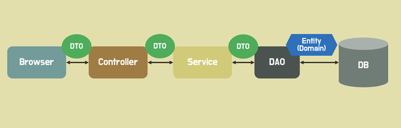

## DTO

DTO(Data Transfer Object)는 데이터 전송 객체이다.

보통 클라이언트와 서버 간 데이터 교환을 위해 사용되나

분리되어 있는 각 계층간에도 데이터 교환을 위해 사용한다.

---
### 1. DTO는 분리되어야 한다.

다음 그림을 보면 각 계층별로 오고가는 DTO가 분리되어 있다.

</img>

하나의 API를 처리할 때, 왜 하나의 DTO로 오고가면 안될까?

왜, 여러개의 DTO를 각각 만들어서 해당 계층 변환 및 데이터 전송만 진행할까?


- 현재 회사의 레거시 소스코드는 빌드된 공통 소스코드를 받아 **메가 DTO**를 통해 요청을 받고 반환해주며 사용하고 있다.

    - 그래서 많은 필드들을 가진 DTO는 300 ~ 400개도 지니고 있다.

        - (심지어 이것도 공통 DTO , entity 상속받음) 

    - 이는 어디서 데이터가 변환되어야 하는지 알 수가 없으며, 각 계층의 기능이 모호해진다.

        - Controller에서 validation check 해야 하는 필드는 무엇인가? 

        - Service에서 어떤 필드들만을 사용해 비즈니스 로직을 처리하고 진행 해야 하는가?

        - Repository에서만 사용하는 Entity는 다른 계층에서 오고 갈 때 필요없다.

    - **SOLID 원칙**을 대부분 위반한다.
        
        - 하나의 책임을 지니지 않고 여러 책임을 지닌다. 결합도가 증가한다. (SRP 원칙 위배)

        - 데이터를 계층 어디서든 변경이 가능하여 무결성이 보장되지 않는다. 이는 변경에 대해 열려있다. (OCP 원칙 위배)

        - 객체는 자신이 호출하지 않는 메소드에 의존하지 않아야 한다. 이는 다른 계층의 데이터를 포함한다. Interface는 아니지만, 원칙에 위배될 수 있다. (ISP 원칙 위배)

        - 추상화에 의존해야 하나, 결합된 모든 클래스가 DTO에 의존한다. (DIP 원칙 위배) 
    
그렇기에 각 계층 별로 DTO를 나눈다.

--- 

### 2. DTO는 데이터를 저장하고 값을 꺼내올 수 있는 책임이 있어야 한다.

많은 개발자들은 getter, setter, builder 어노테이션만을 사용한다. 다른 메서드 만드는 것을 꺼리곤 한다.

그리고 데이터에 대한 검증은 Service에서 진행한다? -> **그렇지 않다.**

어노테이션은 우리가 사용해야 할 메서드를 자동으로 생성해주는 기능이다. (디컴파일시 확인 가능)


클라이언트로부터 다음과 같은 데이터를 받아온다고 가정한다.

```Java
@Getter
public class RequestDto {

    private LocalDateTime nowDate;
    private LocalDateTime targetDate;
    private Double totalAmount;
    private Double amount;
    private Integer count;
    
    /* Getter 어노테이션 사용 */

    public boolean isExpired() {
        return nowDate.isAfter(targetDate);
    }
    public Double getTotalAmount(){
        return amount * count;
    }
}
```

- Service에서 다음과 같이 활용이 가능하다.

- 이를 활용한 난잡한 aPaymentService와 코드와 bPaymentService의 차이점을 보자.

```Java
public class UserService {

    public ResponseDto aPaymentService(RequestDto request){

        if(request.isExpired()) {
            throw new IllegalArgumentException("해당 상품은 현재 팔지 않습니다.");
        }
        
        BigDecimal total = request.getTotalAmount();
        // 수량, 남은 갯수 및 사용자 금액 확인등은 다른 Service에 위임
        return ResponseDto("payment processed", total);
    }

    public ResponseDto bPaymentService(RequestDto request) {
        LocalDateTime nowDate = request.getNowDate();
        LocalDateTime targetDate = request.getTargetDate();
        
        if(nowDate.isAfter(targetDate)) {
            throw new IllegalArgumentException("해당 상품은 현재 팔지 않습니다.");
        }
        Double amount = request.getAmount();
        Integer count = request.getCount();
        Double total = amount * count;

        // 수량, 남은 갯수 및 사용자 금액 확인등은 다른 Service에 위임
        return new ResponseDto("Payment processed", total);
    }

}
```

- Service에서 Validate Check을 하면 변경시 관련 Service를 다 바꾸어 주어야함.

- DTO에서 Validate Check을 해보자.

    - if 문을 사용하여 true , false를 나눠서 리턴해도 괜찮다.

--- 

### 3. DTO 분리를 통해 클라이언트에게 필수값 요청을 하도록 만들어주자.

- @NotNull 어노테이션을 사용하여 클라이언트로부터 필수값에 대한 요청을 요구할 수 있다.

- 만약 여러 계층 혹은 같은 Repository를 호출 한다고 같은 DTO를 사용하면 필수값인가 선택값인가 가름이 어렵기 때문에 @NotNull에 대한 경계가 모호해진다.

- 만약 여러 Controller에서 동일한 데이터 구조를 요구하거나 응답할 경우, 동일한 DTO를 사용하여 일관성 및 유지보수에 도움이 될 수 있을 것이다. (개인적인 생각)

```Java
public class UserDto {
    @NotNull
    private String name;
    // ...
}
```